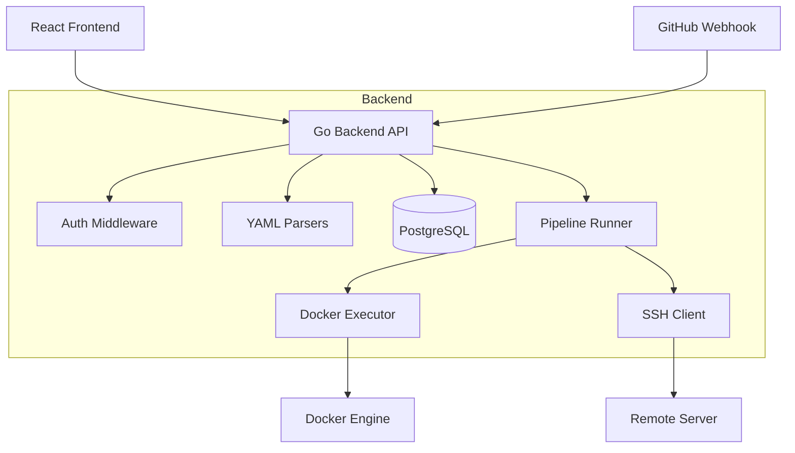

# Technical Documentation

This document provides a deep dive into the architecture, components, and internal workflows of the IMT Cloud CI/CD Engine.

## Architecture Overview

The system is designed as a centralized orchestration engine that manages pipelines, jobs, and deployments. It uses a monolithic Go backend with a modular internal structure, backed by a PostgreSQL database.

### Core Technologies

*   **Language**: Go (Golang) 1.21+
*   **Database**: PostgreSQL 16
*   **Container Runtime**: Docker (accessed via Docker API)
*   **Frontend**: React + TypeScript + Vite + TailwindCSS

---

## 1. Pipeline Engine

The core responsibility of the backend is to execute CI/CD pipelines defined in a `pipeline.yml` file.

### Parsing Logic (`internal/parser/pipeline`)

We utilize a custom lightweight parser inspired by GitLab CI/CD but simplified.

*   **File**: Default is `pipeline.yml` (configurable per project).
*   **Structure**:
    *   `stages`: Ordered list of execution phases (e.g., `build`, `test`, `scan`).
    *   `jobs`: Individual tasks mapped to stages. We currently only support `image` and `script` tags.
*   **Execution Graph**: Jobs in the same stage run sequentially, but strictly respect stage order.

### Job Execution (`internal/api/runner.go` & `internal/executor`)

1.  **Workspace Creation**: For every pipeline run, a unique directory is created in `/tmp/cicd-workspaces/<project>-<commit>`.
2.  **Cloning**: The specific Git commit is cloned into this workspace.
3.  **Environment Injection**: Custom environment variables (secrets) defined in the project settings are injected into the container.
4.  **Docker Execution**:
    *   The `executor` package interfaces with the local Docker daemon.
    *   It pulls the specified image (e.g., `python:3.9`, `node:18`).
    *   It mounts the **workspace** volume to the container.
    *   It executes the defined script commands.
5.  **Log Streaming**: Logs are streamed in real-time from the Docker container to the PostgreSQL database (`job_logs` table), allowing the frontend to display them via polling.

---

## 2. Deployment System

The deployment engine is tightly integrated but distinct from the CI pipeline. It handles the "CD" part, specifically targeting Docker Compose based deployments.

### Docker Compose Versioning (`internal/parser/compose`)

To solve the problem of "which image version to deploy?", we implement an override pattern:

1.  **Base Configuration**: The user provides a standard `docker-compose.yml` in their repo.
2.  **Build & Publish**: The system builds each image one by one, tags them with the **Git Commit Hash**, and publishes them to the Docker Registry. This allows the target server to simply pull the ready-to-use images.
3.  **Override Generation**:
    *   The backend parses the `docker-compose.yml` to find services.
    *   It generates a `docker-compose.override.yml` in memory.
    *   This override forces every service to use the specific image tag associated with the current pipeline commit.
    *   *Result*: `image: myapp:latest` becomes `image: myapp:abc1234`.

### SSH Deployment Flow

Deployment is performed via SSH to a remote host specified in the project settings.

1.  **Connection**: Establishes a secure SSH connection using the stored Private Key.
2.  **Artifact Transfer**: Copies `docker-compose.yml` and the generated `docker-compose.override.yml` to the remote server.
3.  **Conflict Resolution**:
    *   The system parses the compose file to identify hardcoded `container_name` fields.
    *   It executes `docker rm -f <name>` before deployment to ensure no conflicts occur ("Conflict: name already in use").
4.  **Execution**:
    *   Runs `docker compose -p <project-name> up -d`.
    *   The `-p` flag ensures stack isolation.
    *   Wait for health checks.

### Automated Rollback

The system features a self-healing mechanism:

1.  **Failure Detection**: If `docker compose up` fails or containers exit with non-zero codes immediately after startup.
2.  **Lookup**: The database is queried for the **last successful pipeline**.
3.  **Reversion**:
    *   The commit hash of the successful pipeline is retrieved.
    *   A "Rollback Deployment" is triggered using that commit's code and image tags.
    *   The status is updated to `rolled_back`.

---

## 3. Database Schema

The data model relies on a relational structure in PostgreSQL.

*   **`users`**: Authentication info (OAuth provider data).
*   **`projects`**: Configuration (Repo URL, SSH keys, Registry credentials).
*   **`variables`**: Environment variables (secrets) linked to projects. `is_secret` flag controls UI visibility.
*   **`pipelines`**: Execution history (Status, Commit Hash, Branch).
*   **`jobs`**: Individual job status and metadata.
*   **`deployments`**: Tracks deployment attempts, linked to pipelines.
*   **`*_logs`**: Large text tables storing execution output (chunked).

## 4. API & Security

*   **Authentication**: Session-based auth via OAuth2 (Google).
*   **Access Control**: Project-level permissions (Owner/Member). Currently, only owners can modify sensitive settings.
*   **Secret Management**: Secrets (SSH keys, API tokens) are stored in the DB. In a production environment, column-level encryption should be added.

## Future Improvements

*   **Worker Nodes**: Decouple the `runner` from the API server to allow scaling job execution across multiple machines.
*   **WebSockets**: Replace log polling with WebSocket streams for lower latency.
*   **Artifacts**: Support passing files between stages (e.g., build output to test stage).